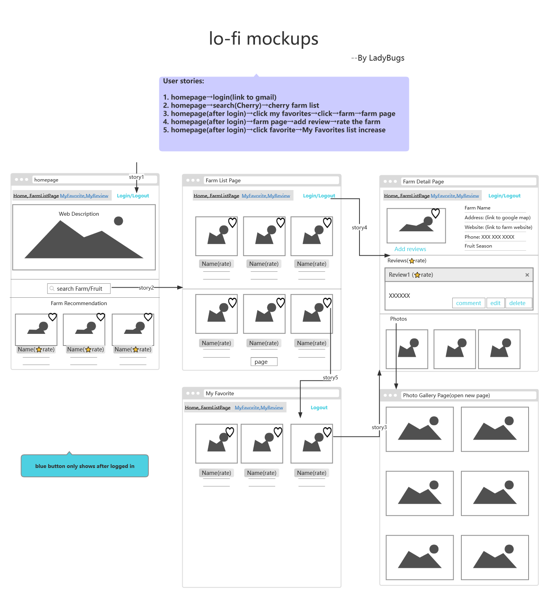
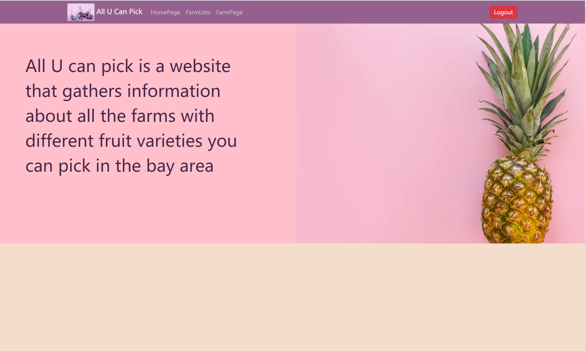
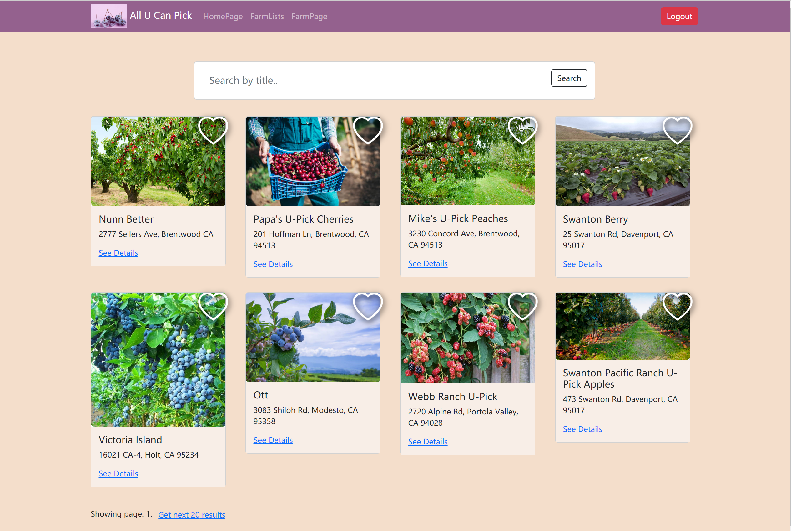
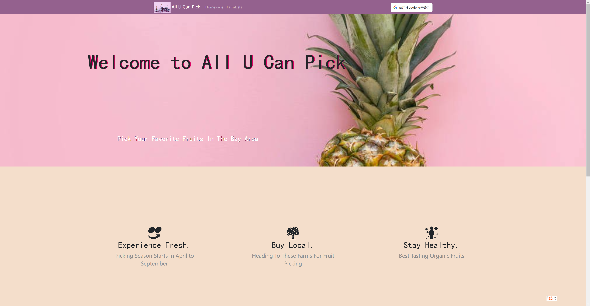
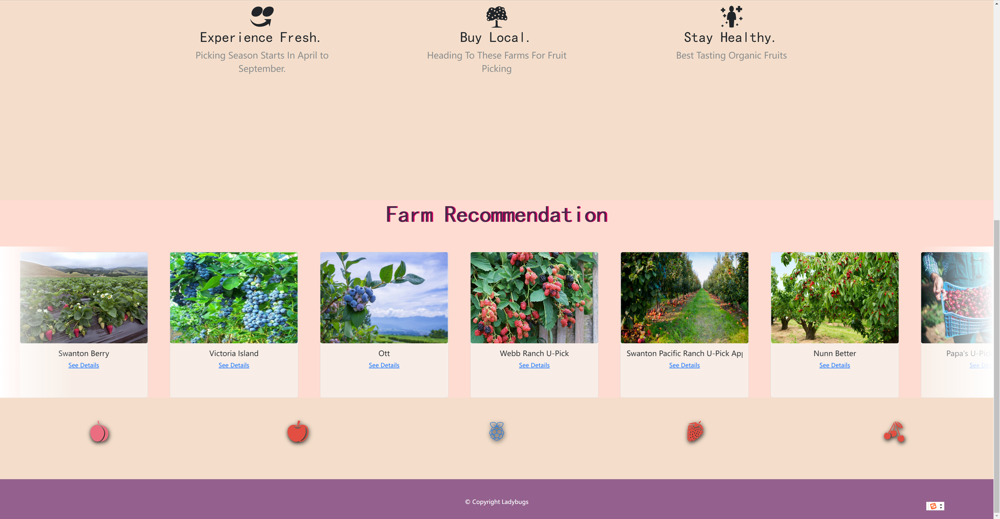
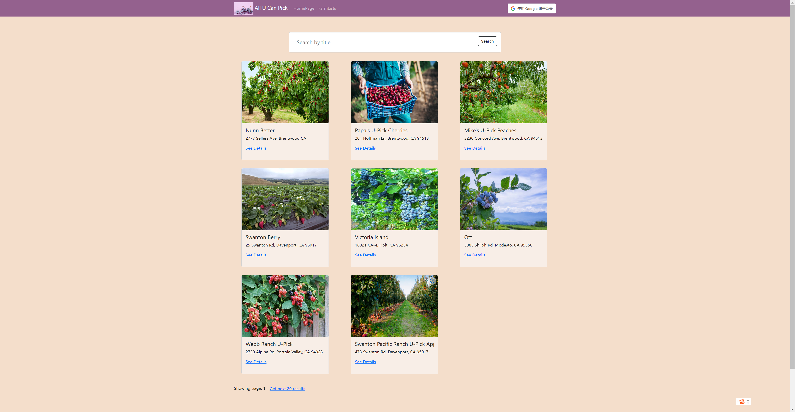
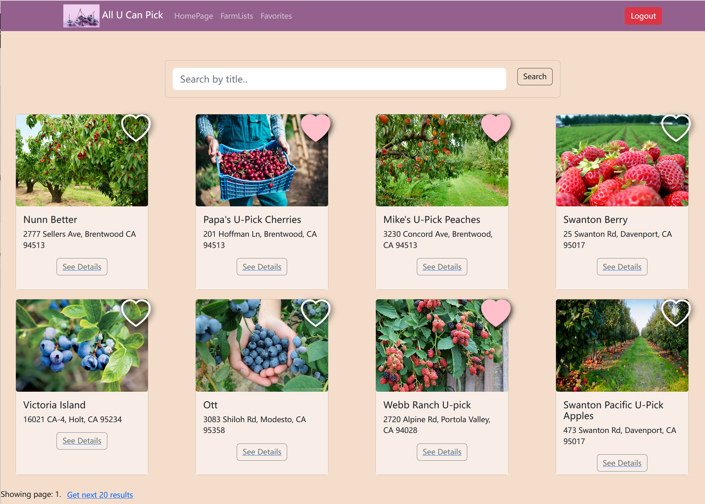

# All U Can Pick - Bay Area (frontend)  
Heroku address: https://all-u-can-pick-frontend.herokuapp.com/   
Group name: The Ladybugs  
Group members: Hongxi Chen, Jingyi Luo, Shasha Wang  
# HOME PAGE

https://user-images.githubusercontent.com/80186905/185049506-8cefb655-3076-4451-b08c-2a3aa17e8200.mp4

# FARM SEARCH

https://user-images.githubusercontent.com/80186905/185049713-73b5acda-0cfb-45b9-ba1b-bba9a2acb3db.mp4

# GOOGLE OAUTH LOGIN && CURD OPERATION

https://user-images.githubusercontent.com/80186905/185049785-33b72f9b-4b25-4ab0-a6bf-9f56da07af6d.mp4

# FAVORITES

https://user-images.githubusercontent.com/80186905/185049835-806df508-17fb-4c2e-aaa9-440a47a89191.mp4

Members' contribution:  
Shasha Wang: 
1. Set up all necessary backend code for database CURD operation. 
2. implemented backend CURD api for frontend to use
3. implement backend request routing.
4. implmented frontend service api to send different request to backend, so the different component can use the data service to execute CURD operation on database.
5. setup heroku for both frontend and backend and cloud mongodb on Atlas. 
6. design mongodb schema for farms, reviews and favorites farms.
7. add favorite backend function. Enable frontend to display favorite(link) when user logs in   

Hongxi Chen:
1.	Design and style background/favicon/icon for website
2.  Search 3rd party libraries we will incorporate for our website
3.  Use React Components: Carousels for picture at Landing Page
4.	Setup Navbar component
5.	Setup Login/Logout Component
6.  Setup Footer
7.	Set up Landing and FarmsList Page, design style and use appropriate api service, using react-fast-marquee that utilizes the power of CSS animations to create silky smooth marquees.  

Jingyi Luo:
1.	Setup FarmPage component
2.	Setup Addreview component

## lo-fi mock-ups (wireframes) 

## Iteration 1 - Laying the groundwork for the frontend

## Iteration 2 - Laying the groundwork for the frontend

   

## Iteration 3 - Laying the groundwork for the frontend

   
  
                                                  

==========================================================
# Getting Started with Create React App

This project was bootstrapped with [Create React App](https://github.com/facebook/create-react-app).

## Available Scripts

In the project directory, you can run:

### `npm start`

Runs the app in the development mode.\
Open [http://localhost:3000](http://localhost:3000) to view it in your browser.

The page will reload when you make changes.\
You may also see any lint errors in the console.

### `npm test`

Launches the test runner in the interactive watch mode.\
See the section about [running tests](https://facebook.github.io/create-react-app/docs/running-tests) for more information.

### `npm run build`

Builds the app for production to the `build` folder.\
It correctly bundles React in production mode and optimizes the build for the best performance.

The build is minified and the filenames include the hashes.\
Your app is ready to be deployed!

See the section about [deployment](https://facebook.github.io/create-react-app/docs/deployment) for more information.

### `npm run eject`

**Note: this is a one-way operation. Once you `eject`, you can't go back!**

If you aren't satisfied with the build tool and configuration choices, you can `eject` at any time. This command will remove the single build dependency from your project.

Instead, it will copy all the configuration files and the transitive dependencies (webpack, Babel, ESLint, etc) right into your project so you have full control over them. All of the commands except `eject` will still work, but they will point to the copied scripts so you can tweak them. At this point you're on your own.

You don't have to ever use `eject`. The curated feature set is suitable for small and middle deployments, and you shouldn't feel obligated to use this feature. However we understand that this tool wouldn't be useful if you couldn't customize it when you are ready for it.

## Learn More

You can learn more in the [Create React App documentation](https://facebook.github.io/create-react-app/docs/getting-started).

To learn React, check out the [React documentation](https://reactjs.org/).

### Code Splitting

This section has moved here: [https://facebook.github.io/create-react-app/docs/code-splitting](https://facebook.github.io/create-react-app/docs/code-splitting)

### Analyzing the Bundle Size

This section has moved here: [https://facebook.github.io/create-react-app/docs/analyzing-the-bundle-size](https://facebook.github.io/create-react-app/docs/analyzing-the-bundle-size)

### Making a Progressive Web App

This section has moved here: [https://facebook.github.io/create-react-app/docs/making-a-progressive-web-app](https://facebook.github.io/create-react-app/docs/making-a-progressive-web-app)

### Advanced Configuration

This section has moved here: [https://facebook.github.io/create-react-app/docs/advanced-configuration](https://facebook.github.io/create-react-app/docs/advanced-configuration)

### Deployment

This section has moved here: [https://facebook.github.io/create-react-app/docs/deployment](https://facebook.github.io/create-react-app/docs/deployment)

### `npm run build` fails to minify

This section has moved here: [https://facebook.github.io/create-react-app/docs/troubleshooting#npm-run-build-fails-to-minify](https://facebook.github.io/create-react-app/docs/troubleshooting#npm-run-build-fails-to-minify)
